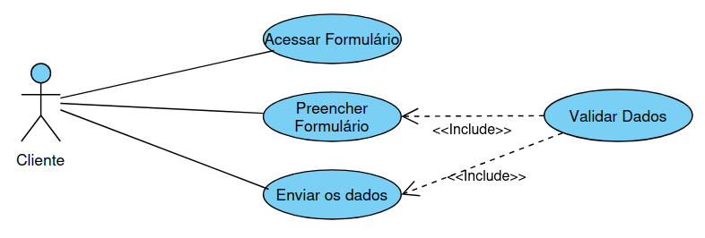
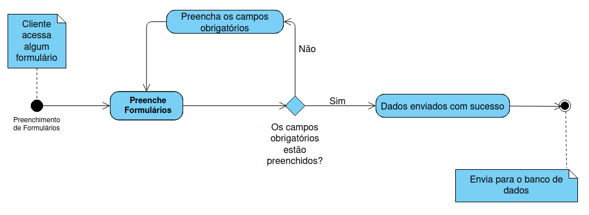

<h1>Trânsito Leme</h1>
<h2>Desenvolvimento na parte do Cliente(Usuário)</h2>

- [x] Desenvolvendo um site para uma empresa de trânsito.
- [x] Tecnologias que estão sendo utilizadas: PHP, JavaScript, CSS, TailwindCSS, Flowbite e MySQL.
- [x] O usuário pode solicitar alguns serviços on-line relacionados a trânsito como, retirada ou implantação de lombadas, multas, sinalizações, bicicletas,informações sobre a zona-azul, interdições, semáforos.E em relação de vagas especiais, pode solicitar um cartão de estacionamento para idoso ou deficiente.

<h3>Diagramas para compreensão do desenvolvimento</h3>

Quando acessar qualquer formulário: contato, cartão do idoso, cartão do deficiente e solicitações para renovação, cancelamento e segunda via.

<h3>Diagrama de casos de uso - Cliente</h3>

 

<h3>Diagrama de atividades - Cliente</h3>

<h2>Deselvolvimento na parte administrativa (Usuário administrativo)</h2>

O site administrativo tem como finalidade de lidar com os dados dos usuários que estão vindo pela parte do cliente ao utilizar o site principal.

No site adiminstrativo o usuário tem controle para validação de dados que vem dos formulários, como dos cartões do idoso e do deficiente, podendo ver através das notificações em tempo real.

Para ter acesso a esse site <strong>Login: teste, Senha: teste</strong>

<a href="https://novo.transitoleme.sp.gov.br/admin/">Trânsito Administrativo - Clique aqui!!</a>
