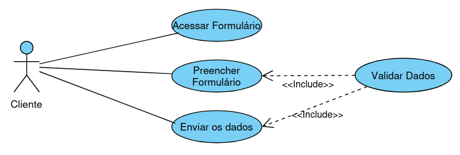
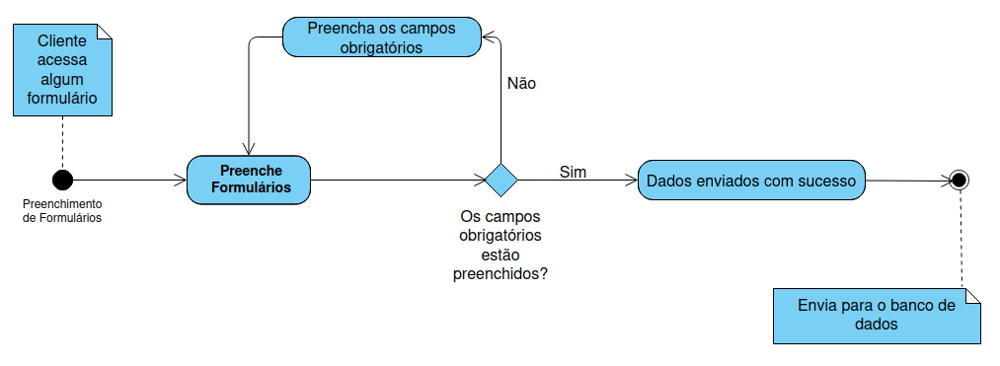

<h1>Trânsito Leme</h1>

<h2>Desenvolvimento na parte do Cliente(Usuário)</h2>

- Desenvolvendo um site para Coordenadoria de Trânsito do Município de Leme/SP.

- Linguagens de programação: PHP, JavaScript, HTML e CSS.

- Bibliotecas/Frameworks: TailwindCSS, Flowbite, QuillJS, FPDI/FPDF(Convertor de PDF do PHP).

- Banco de dados: MySQL.

- Hospedagem: HostMídia.

- Deploy: GitHub Actions via FTP.

- O usuário pode solicitar alguns serviços on-line relacionados a trânsito como, retirada ou implantação de lombadas, multas, sinalizações, bicicletas, informações sobre a zona-azul, interdições, semáforos. E em relação de vagas especiais, podem solicitar uma credencial de estacionamento para idoso ou deficiente conforme necessidade.

- Caso o usuário queira solicitar um cartão de estacionamento para idoso ou deficiente, ele tem que preencher um formulário com seus dados nos campos obrigatórios. Após o envio do formulário, seus dados são enviados para a administração, onde serão responsáveis lançar as credenciais.

<h3>Diagramas para compreensão do desenvolvimento</h3>

Quando acessar qualquer formulário: contato, cartão do idoso, cartão do deficiente e solicitações para renovação, cancelamento e segunda via(furto/roubo, perda ou dano).

<h3>Diagrama de casos de uso - Cliente</h3>

 

<h3>Diagrama de atividades - Cliente</h3>

 

<h1>Desenvolvimento na parte administrativa </h1>

O site administrativo tem como finalidade de lidar com os dados dos usuários que estão vindo pela parte do cliente ao utilizar o site principal.

No site administrativo o usuário tem controle para validação de dados que vem dos formulários, como dos cartões do idoso e do deficiente, podendo ver através das notificações.

O usuário pode registrar o cartão do idoso, tendo acesso à página que mostra o arquivo gerado em PDF, podendo realizar a impressão destes arquivos.

O usuário administrativo tem acesso às notícias e as telas das páginas podendo alterar o seu conteúdo utilizando um formatador de texto.

